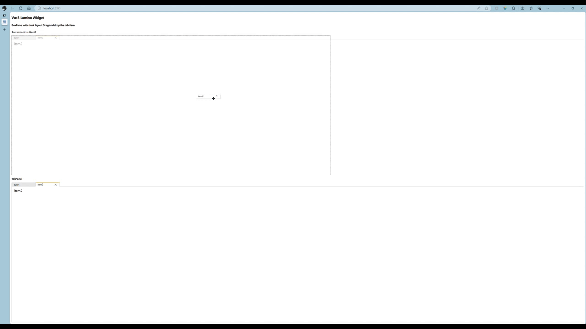

# vue3 lumino widget [![npm][npm-image]][npm-url] [![downloads][downloads-image]][downloads-url]

[npm-image]: https://img.shields.io/npm/v/vue3-lumino-widget.svg
[npm-url]: https://npmjs.org/package/vue3-lumino-widget
[downloads-image]: https://img.shields.io/npm/dm/vue3-lumino-widget.svg
[downloads-url]: https://npmjs.org/package/vue3-lumino-widget

A Vue.js wrapper for jupyter [lumino](https://github.com/jupyterlab/lumino) package



# Getting Started

Install `vue3-lumino-widget` with npm:

```bash
npm install vue3-lumino-widget
```

with yarn:

```bash
yarn add vue3-lumino-widget
```

## Usage

Import the component or register it globally in your Vue instance:

```vue
import { LuminoBoxPanel, LuminoWidget } from "vue3-lumino-widget"
// this style include the lumino style; but lumino depends on the fontawsome for icon, it too big
// if your project already using it, it's well, if not, maybe you can replace the "X" icon by css using other font.
import 'vue3-lumino-widget/dist/style.css'
// import "@fortawesome/fontawesome-free/css/all.css"
```

By the way, to make close icon more customable, see this [pull request in lumino](https://github.com/jupyterlab/lumino/pull/669).

Use the component in your template:

```vue
<template>
  <div class="container">
    <h4>Vue3 Lumino Widget</h4>
    <h6>Drag and drop the tab item</h6>
    <h6>Current active: {{ active?.item.name || 'none' }}</h6>
    <LuminoBoxPanel>
      <LuminoWidget v-for="item in items"
                    :key="item.id"
                    @close="onLuminoWidgetClose"
                    @active="onLuminoWidgetActive"
                    @show="onLuminoWidgetShow"
                    :title-active-class="activeClass"
                    :closable="item.closable"
                    :item="item">
        <p class="item-component">{{ item.name }}</p>
      </LuminoWidget>
    </LuminoBoxPanel>
  </div>
</template>

<script setup lang="ts">
import LuminoBoxPanel from "./components/LuminoBoxPanel.vue"
import LuminoWidget from "./components/LuminoWidget.vue"
import { ref } from 'vue'
import { ItemWidget, WidgetEvent } from "./components/ItemWidget"

const items = ref([
  { id: 'id1', name: 'item1', closable: false },
  { id: 'id2', name: 'item2' }
])

const active = ref<ItemWidget>()

const onLuminoWidgetClose = ({ msg, widget, item }: WidgetEvent) => {
  // do some thing, then doClose item.
  widget.doClose(msg)
}

const onLuminoWidgetActive = ({ msg, widget, item }: WidgetEvent) => {
  active.value = widget
}

const onLuminoWidgetShow = ({ msg, widget, item }: WidgetEvent) => {
  active.value = widget
}

const activeClass = ref('item-active-0')
let onOff = false

setInterval(() => {
  onOff = !onOff
  activeClass.value = onOff ? 'item-active-0' : 'item-active-1'
}, 1000)

</script>

<style scoped lang="scss">
.container {
  height: 100%;
  display: flex;
  flex-direction: column;

  h4,
  h6 {
    margin-top: 10px;
    margin-bottom: 10px;
  }

  :deep(.item-active-0) {
    border-top: orange 2px solid;
  }

  :deep(.item-active-1) {
    border-top: palevioletred 2px solid;
  }

  .item-component {
    margin: 10px;
  }
}
</style>

```
